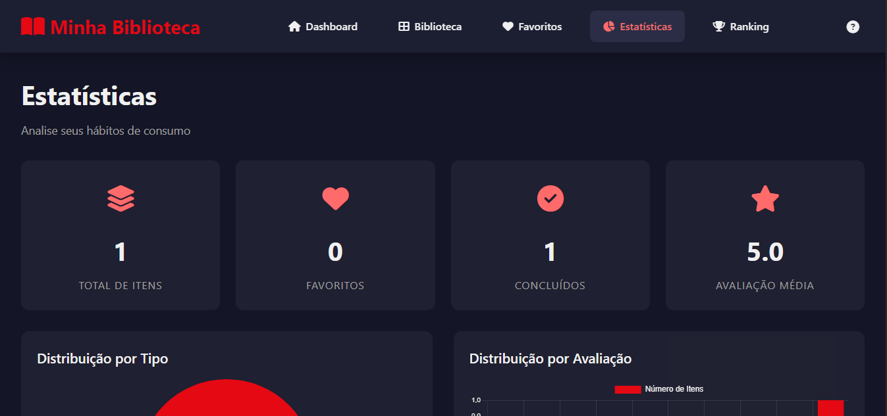
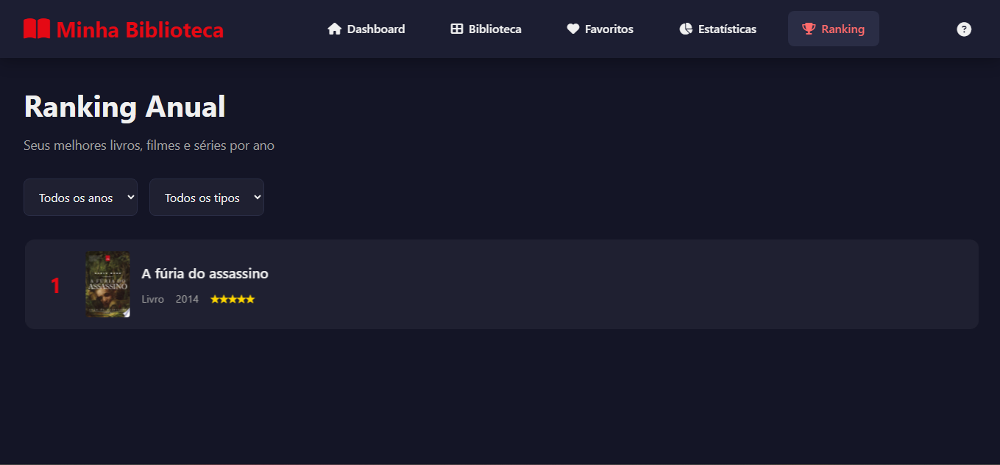
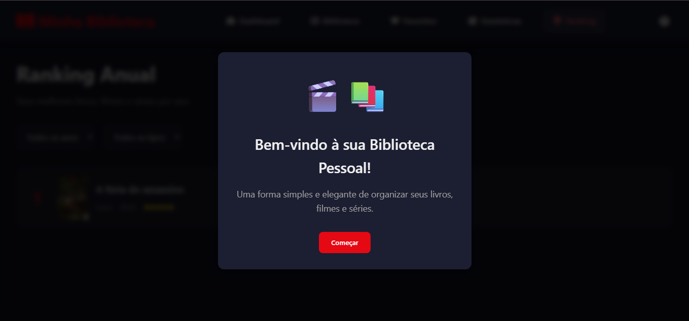
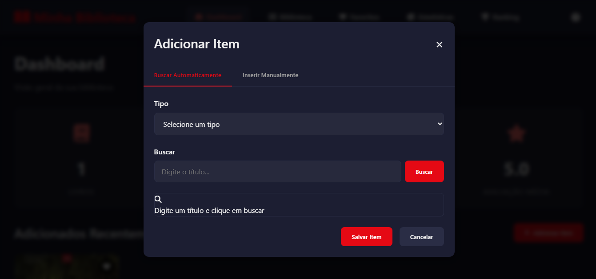

# Lumi

 
 
 
 
 

**Lumi** é uma aplicação web **SPA (Single Page Application)** desenvolvida em **JavaScript puro**, que permite aos usuários **gerenciar, organizar e avaliar livros, filmes e séries**, no estilo de plataformas como Letterboxd. É possível marcar itens como “já assistido” ou “já lido”, atribuir notas e criar rankings personalizados de forma dinâmica e interativa.

---

## 🌟 Funcionalidades

- Adicionar livros, filmes ou séries à biblioteca pessoal.  
- Marcar itens como **já lidos ou assistidos**.  
- Avaliar itens com notas ou estrelas.  
- Criar rankings personalizados.  
- Visualizar estatísticas e progresso da coleção.  
- SPA totalmente dinâmica, sem recarregar a página.  
- Persistência local usando **LocalStorage**.  
- Busca automática de **imagens e informações** de livros, filmes ou séries usando APIs externas (Google, IMDb, etc.).

---

## 🎬 Capturas de tela / Demonstração

  
  
  
  

**Demonstração online:** [Clique aqui para abrir o Lumi no GitHub Pages](https://ayaycabron.github.io/lumi)

---

## 🛠 Tecnologias utilizadas

- **HTML5**  
- **CSS3**  
- **JavaScript (ES6+)**  
- **LocalStorage** (para persistência de dados)  
- **APIs externas** (Google, IMDb, etc.) para busca de dados e imagens  

---

## 🚀 Como usar

1. Clone o repositório:
```bash
git clone https://github.com/AyayCabron/lumi.git
Abra o arquivo index.html no navegador.

Navegue pela aplicação e gerencie sua biblioteca de livros, filmes e séries.

🤝 Contribuição
Contribuições são bem-vindas! Faça um fork do repositório e envie pull requests para melhorias ou novas funcionalidades.

📄 Licença
Este projeto está sob a licença MIT.
